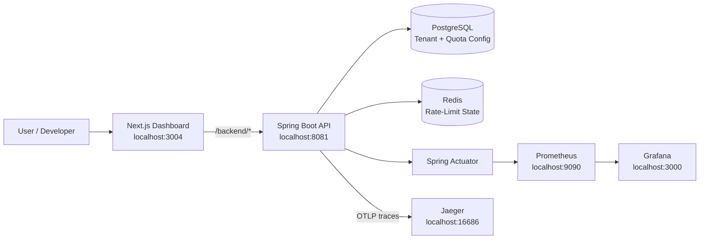

# QuotaForge

QuotaForge is a full-stack **multi-tenant distributed rate-limiting platform** for creating API tenants, assigning request quotas, enforcing those quotas, and monitoring live usage from a web dashboard.

The project is organized as a monorepo:

```text
quotaforge/
├── backend/      # Spring Boot rate-limiting service
├── frontend/     # Next.js dashboard
└── README.md
```

The backend uses PostgreSQL for durable tenant/quota configuration, Redis for distributed rate-limit state, Flyway for database migrations, and Spring Actuator/OpenTelemetry for observability. The frontend provides a simple dashboard for creating tenants, viewing usage, deleting tenants, and sending test requests against the rate limiter.

---

## Features

- Multi-tenant API quota management
- API-key based request identification
- Configurable request limits per tenant
- Configurable rate-limit windows
- Redis-backed distributed rate limiting
- PostgreSQL-backed tenant and quota configuration
- Flyway database migrations
- Cached tenant quota lookup
- Live tenant usage dashboard
- Test-request button for validating rate limits
- Spring Boot Actuator health and Prometheus metrics
- OpenTelemetry tracing with Jaeger
- Prometheus monitoring
- Grafana visualization environment
- Docker Compose development infrastructure

---

## Tech Stack

### Backend

- Java 21
- Spring Boot 4
- Spring Web MVC
- Spring JDBC
- Spring Data Redis
- Spring Cache
- Caffeine
- PostgreSQL
- Flyway
- OpenTelemetry
- Micrometer / Prometheus
- Gradle

### Frontend

- Next.js 16
- React 19
- TypeScript
- Tailwind CSS 4

### Infrastructure / Observability

- Docker Compose
- PostgreSQL 17
- Redis 7
- Jaeger
- Prometheus
- Grafana

---

## Architecture



### Request Flow

A typical rate-limit check works like this:

1. A tenant is created with a name, request limit, and time window.
2. QuotaForge generates an API key for that tenant.
3. Tenant and quota configuration is persisted in PostgreSQL.
4. A client sends a request with the API key in the `X-API-Key` header.
5. The backend looks up the tenant's quota configuration.
6. Redis maintains the shared request-usage state for the active window.
7. The backend either allows the request or returns a rate-limited response.
8. The dashboard periodically refreshes tenant usage so the current quota consumption is visible.

---

## Repository Structure

```text
quotaforge/
│
├── backend/
│   ├── src/
│   │   ├── main/
│   │   │   ├── java/
│   │   │   └── resources/
│   │   │       └── db/
│   │   │           └── migration/
│   │   └── test/
│   ├── build.gradle
│   ├── settings.gradle
│   ├── docker-compose.yml
│   ├── prometheus.yml
│   ├── gradlew
│   └── gradlew.bat
│
├── frontend/
│   ├── app/
│   ├── package.json
│   ├── tsconfig.json
│   └── next.config.ts
│
├── .gitignore
└── README.md
```

---

# Local Development

## Prerequisites

Install the following before running QuotaForge:

- **Git**
- **Java 21**
- **Docker Desktop**
- **Node.js 20+**
- **npm**

You do **not** need to manually install PostgreSQL, Redis, Prometheus, Jaeger, or Grafana. Docker Compose starts those services for you.

Verify your local tools:

```bash
git --version
java --version
docker --version
node --version
npm --version
```

---

## 1. Clone the Repository

```bash
git clone https://github.com/TanayDesai-1510/quotaforge.git
cd quotaforge
```

---

## 2. Start Backend Infrastructure

The Docker Compose configuration is inside the `backend` folder.

```bash
cd backend
docker compose up -d
```

This starts:

| Service | Local Address / Port | Purpose |
|---|---|---|
| PostgreSQL | `localhost:5433` | Tenant and quota persistence |
| Redis | `localhost:6379` | Distributed rate-limit state |
| Jaeger | `http://localhost:16686` | Distributed tracing UI |
| Prometheus | `http://localhost:9090` | Metrics collection |
| Grafana | `http://localhost:3000` | Metrics visualization |

Check that the containers are running:

```bash
docker compose ps
```

To view container logs:

```bash
docker compose logs -f
```

---

## 3. Start the Backend

Keep the infrastructure running and open another terminal.

### Windows / PowerShell

```powershell
cd C:\path\to\quotaforge\backend
.\gradlew.bat bootRun
```

### macOS / Linux

```bash
cd /path/to/quotaforge/backend
./gradlew bootRun
```

The backend runs at:

```text
http://localhost:8081
```

Verify it:

```text
http://localhost:8081/actuator/health
```

A healthy application should return a Spring Boot health response with an `UP` status.

---

## 4. Start the Frontend

Open another terminal from the repository root:

```bash
cd frontend
npm install
npm run dev
```

The frontend runs at:

```text
http://localhost:3004
```

Open that URL in your browser.

The Next.js development server rewrites requests beginning with:

```text
/backend/*
```

to:

```text
http://localhost:8081/*
```

This lets the dashboard communicate with the Spring Boot application through the Next.js development server.

---

# Quick Start

Once dependencies have been installed at least once, normal development only requires three terminals.

### Terminal 1 — Infrastructure

```bash
cd backend
docker compose up -d
```

### Terminal 2 — Backend

Windows:

```powershell
cd backend
.\gradlew.bat bootRun
```

macOS / Linux:

```bash
cd backend
./gradlew bootRun
```

### Terminal 3 — Frontend

```bash
cd frontend
npm run dev
```

Then open:

```text
http://localhost:3004
```

---

# Using QuotaForge

## Create a Tenant

From the dashboard:

1. Enter a tenant name.
2. Enter the maximum number of requests.
3. Enter the window length in seconds.
4. Click **Create**.

For example:

```text
Tenant: demo-client
Limit: 100
Window: 60 seconds
```

This represents:

```text
100 requests per 60 seconds
```

After creation, the tenant card displays its generated API key and current usage.

---

## Send a Test Request

Each tenant card includes a **Send test request** button.

The request is sent to the backend with:

```http
X-API-Key: <tenant-api-key>
```

The UI indicates whether the request was:

```text
Allowed
```

or:

```text
Rate limited
```

The dashboard refreshes tenant usage every few seconds.

---

# API

## List Tenants

```http
GET /admin/tenants
```

Example:

```bash
curl http://localhost:8081/admin/tenants
```

---

## Create Tenant

```http
POST /admin/tenants
Content-Type: application/json
```

Example body:

```json
{
  "name": "demo-client",
  "maxRequests": 100,
  "windowSeconds": 60
}
```

Example with `curl`:

```bash
curl -X POST http://localhost:8081/admin/tenants \
  -H "Content-Type: application/json" \
  -d "{\"name\":\"demo-client\",\"maxRequests\":100,\"windowSeconds\":60}"
```

PowerShell:

```powershell
Invoke-RestMethod `
  -Uri "http://localhost:8081/admin/tenants" `
  -Method Post `
  -ContentType "application/json" `
  -Body '{"name":"demo-client","maxRequests":100,"windowSeconds":60}'
```

---

## Delete Tenant

```http
DELETE /admin/tenants/{tenantId}
```

Example:

```bash
curl -X DELETE http://localhost:8081/admin/tenants/<tenant-id>
```

---

## Check Rate Limit

```http
GET /api/check
X-API-Key: <api-key>
```

Example:

```bash
curl http://localhost:8081/api/check \
  -H "X-API-Key: YOUR_API_KEY"
```

PowerShell:

```powershell
Invoke-WebRequest `
  -Uri "http://localhost:8081/api/check" `
  -Headers @{"X-API-Key"="YOUR_API_KEY"}
```

Repeat the request until the tenant reaches its configured quota to test rate limiting.

---

# Database

QuotaForge uses PostgreSQL for persistent configuration.

Local development connection:

```text
Host: localhost
Port: 5433
Database: quotaforge
Username: quotaforge
Password: quotaforge
```

These credentials are intended for local development only.

Flyway automatically runs database migrations when the Spring Boot application starts.

The current schema includes tenant records and tenant-specific quota configuration.

---

# Redis

Redis runs on:

```text
localhost:6379
```

Redis stores shared rate-limit state so usage is not tied to a single application process.

To connect to Redis inside the Docker container:

```bash
docker exec -it quotaforge-redis redis-cli
```

Useful commands while debugging:

```redis
PING
KEYS *
```

> `KEYS *` is useful for local debugging but should not be used on large production Redis instances.

---

# Observability

QuotaForge includes a local observability stack.

## Spring Boot Health

```text
http://localhost:8081/actuator/health
```

---

## Prometheus Metrics

Spring exposes Prometheus metrics at:

```text
http://localhost:8081/actuator/prometheus
```

Prometheus runs at:

```text
http://localhost:9090
```

The included Prometheus configuration scrapes the backend every 5 seconds.

---

## Jaeger Tracing

Jaeger UI:

```text
http://localhost:16686
```

QuotaForge exports OpenTelemetry traces to Jaeger's OTLP HTTP receiver.

After sending requests through the application:

1. Open Jaeger.
2. Select the QuotaForge service.
3. Search for traces.

---

## Grafana

Grafana runs at:

```text
http://localhost:3000
```

Local development credentials:

```text
Username: admin
Password: admin
```

If a Prometheus data source has not already been configured, add:

```text
http://prometheus:9090
```

as the Prometheus server URL from inside Grafana's Docker network.

---

# Running Tests

## Backend Tests

Windows:

```powershell
cd backend
.\gradlew.bat test
```

macOS / Linux:

```bash
cd backend
./gradlew test
```

---

## Backend Build

Windows:

```powershell
cd backend
.\gradlew.bat clean build
```

macOS / Linux:

```bash
cd backend
./gradlew clean build
```

---

## Frontend Lint

```bash
cd frontend
npm run lint
```

---

## Frontend Production Build

```bash
cd frontend
npm run build
```

Run the production build with:

```bash
npm run start
```

---

# Stopping the Project

Stop the frontend and backend with `Ctrl + C` in their terminals.

Then stop the infrastructure:

```bash
cd backend
docker compose down
```

This keeps the PostgreSQL Docker volume.

To also delete the local PostgreSQL data:

```bash
docker compose down -v
```

> `docker compose down -v` permanently deletes the Docker-managed PostgreSQL development data.

---

# Troubleshooting

## Backend cannot connect to PostgreSQL

Make sure the database container is healthy:

```bash
cd backend
docker compose ps
```

You can also inspect its logs:

```bash
docker compose logs postgres
```

The backend expects PostgreSQL at:

```text
localhost:5433
```

---

## Backend cannot connect to Redis

Verify Redis:

```bash
docker compose ps
docker exec -it quotaforge-redis redis-cli ping
```

Expected output:

```text
PONG
```

---

## Port already in use

QuotaForge uses the following local ports:

```text
3000  Grafana
3004  Frontend
4318  OpenTelemetry / Jaeger
5433  PostgreSQL
6379  Redis
8081  Backend
9090  Prometheus
16686 Jaeger UI
```

If another application is using one of these ports, stop that process or update the corresponding configuration.

---

## Frontend loads but API requests fail

Make sure the backend is running on:

```text
http://localhost:8081
```

Then verify:

```text
http://localhost:8081/actuator/health
```

The frontend development proxy expects the backend specifically on port `8081`.

---

## Gradle wrapper fails on Windows

Run:

```powershell
.\gradlew.bat --version
```

and confirm Java 21 is available:

```powershell
java --version
```

---

# Development Notes

QuotaForge is currently designed as a development/demo implementation of a multi-tenant distributed rate limiter.

Before treating the system as production-ready, areas that would normally need additional hardening include:

- authentication and authorization for administration endpoints
- secure secret and database credential management
- API-key hashing / rotation strategy
- production Redis persistence and/or high availability strategy
- database and Redis TLS
- stricter CORS / reverse-proxy configuration
- integration and load testing
- production observability configuration
- containerization of the Spring Boot and Next.js applications
- CI/CD
- deployment-specific configuration through environment variables

The Docker Compose credentials included in this repository are intended only for local development.

---

# Useful URLs

| Component | URL |
|---|---|
| QuotaForge Dashboard | `http://localhost:3004` |
| Backend API | `http://localhost:8081` |
| Backend Health | `http://localhost:8081/actuator/health` |
| Backend Prometheus Metrics | `http://localhost:8081/actuator/prometheus` |
| Grafana | `http://localhost:3000` |
| Prometheus | `http://localhost:9090` |
| Jaeger | `http://localhost:16686` |

---

## Author

**Tanay Desai**

GitHub: [@TanayDesai-1510](https://github.com/TanayDesai-1510)

---

## License

No license has been added to this repository yet.
